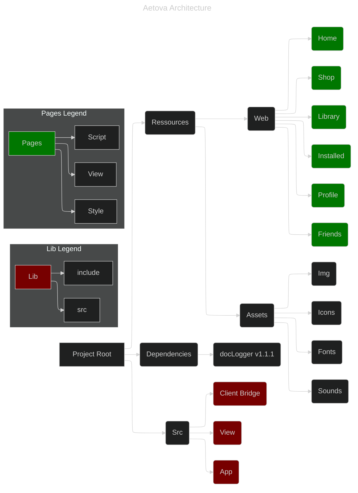

```mermaid
---
title: Aetova Architecture
config: 
    theme: dark
    layout: elk
    themeVariables:
        primaryTextColor: '#000'
---
graph LR

    classDef LibColor fill:#770000
    classDef PageColor fill:#007700

    A[Project Root]
    A --> B(Ressources)
    B --> BA(Web)
    BA --> BAA(Home)
    BA --> BAB(Shop)
    BA --> BAC(Library)
    BA --> BAD(Installed)
    BA --> BAE(Profile)
    BA --> BAF(Friends)
    B --> BB(Assets)
    BB --> BBA(Img)
    BB --> BBB(Icons)
    BB --> BBC(Fonts)
    BB --> BBD(Sounds)
    A --> C(Dependencies)
    C --> CA(docLogger v1.1.1)
    A --> D(Src)
    D --> DA(Client Bridge)
    D --> DB(View)
    D --> DC(App)

    class DA LibColor
    class DB LibColor
    class DC LibColor

    class BAA PageColor
    class BAB PageColor
    class BAC PageColor
    class BAD PageColor
    class BAE PageColor
    class BAF PageColor

subgraph Lib Legend
    Lib --> include
    Lib --> src
    class Lib LibColor
end

subgraph Pages Legend
    Pages --> View
    Pages --> Style
    Pages --> Script
    class Pages PageColor
end
```
